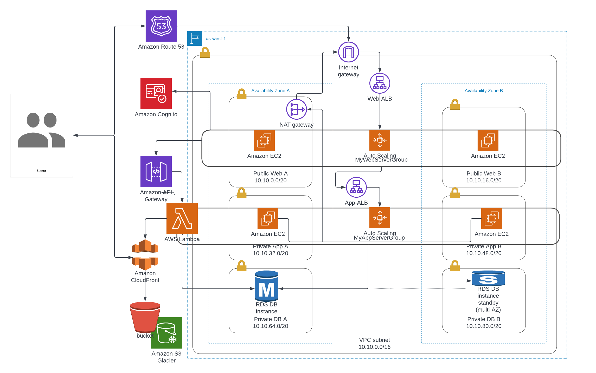

# individual-project1-zisyang
- CMPE-281 Sec 48 - Cloud Technologies

Create a highly available, highly scalable, cost effective 3 tier web application which would be accessible over public internet through the registered domain name

➢ The website URL is : http://cmpe281.team-strikers.link/index.html
(note: the website host in AWS, since AWS charged about $18+, so the services are shuted-down now)

### The web application allow authorized users to perform following operations: 
- Upload new files. (max size 10 MB per file) (Create)
- User can upload file, max size at 10 MB
- Browse through already uploaded list of files with each record having a URL to
download the fie. (Read/ List Page)
  - User can see the list of files uploaded
  - User also can download the file by clicking the download button associate
to the row of record
- Update already uploaded files. (Update Page)
  - After user download the file and modify, user can upload the modified on under same file name, then system will create a new version for that file
- Delete already uploaded file (Delete Page)
  - User can delete the uploaded file from the after list

### For each file upload, application includes the following fields: 
- User’s email
- User’s first name 
- User’s last name 
- File Upload Time  
- File Updated Time  
- File Description  
- File Download link  
- File version

## Architecture Diagram


## Prerequisites of AWS Services:
- Cognito
- VPC
- EC2
- AutoScaling Group
- ELB
- Single AZ RDS
- Lambda
- API Gateway
- IAM
- S3
- CloudFront
- S3 Transfer Acceleration
- S3 LifeCycle
- Route 53
- CloudWatch
- SNS
- AWS S3 presigned URLs with SAM
- AWS SDK
  
## Tree of code
```
.
├── app/            <-- This is to run in app-tier EC2 instances
├── lambda/         <-- This contains codes to run in each Lambda functions
├── web/            <-- This is to run in web-tier EC2 instances
```

## Screenshots of Test execution and result


